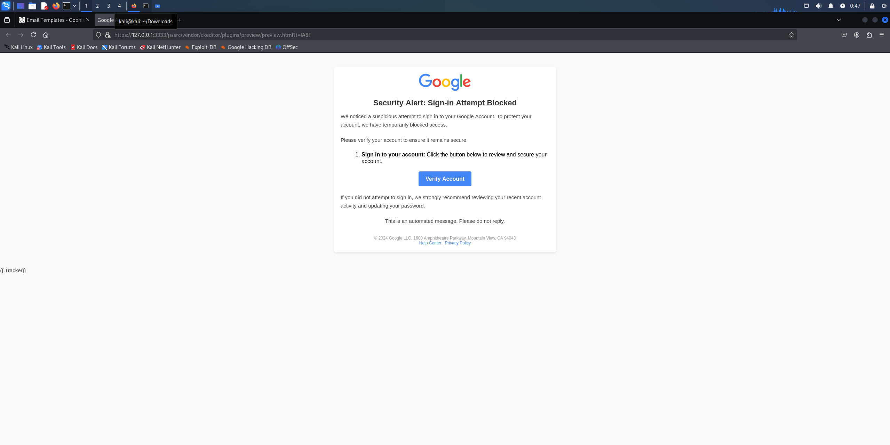
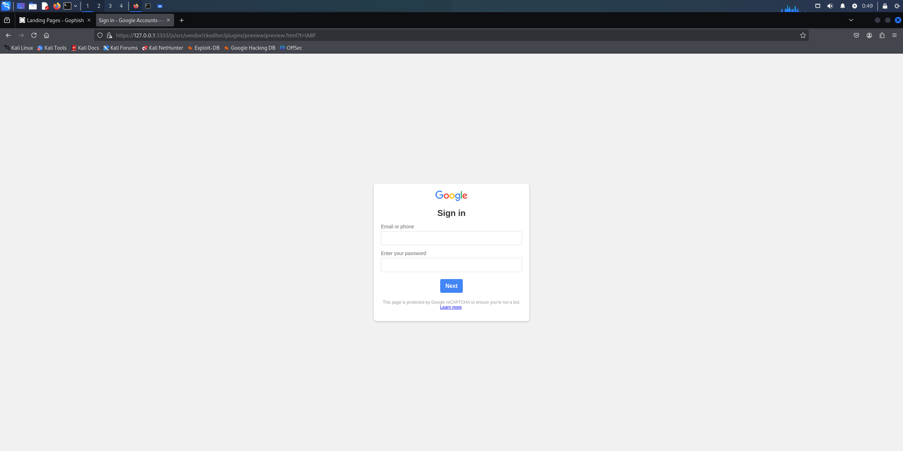

# **Phishing Email Templates for Awareness Campaigns**

## **Overview**
This repository contains custom HTML email templates designed for phishing awareness campaigns. These templates are compatible with GoPhish and simulate phishing scenarios to help organizations educate users on recognizing and responding to phishing attempts.

---

## **Features**
- **Professional Design**: Realistic templates mimicking common phishing scenarios.
- **Custom Branding**: Includes placeholders for logos and banners.
- **Editable Content**: Fully customizable HTML files for tailored scenarios.
- **Responsive Design**: Optimized for various devices and email clients.

---

## **Usage Instructions**
1. Clone the repository to your local machine:
   ```bash
   git clone https://github.com/dle6/GoPhish.git
2. Edit the HTML templates to fit your organization’s branding or specific scenarios.
3. Upload the templates to GoPhish:
4. Navigate to "Email Templates" in the GoPhish dashboard.
5. Create a new template and paste the HTML content from the files.
6. Host the static resources (images, logos) on a public server or adjust the paths to match your setup.
7. Test and deploy the campaign.


## Example Template: Google Email

Below is an example of a phishing email template and Google sign-in that mimics a Google notification email:




---

## Notes on Landing Page and Educational Static Page Integration

### Overview
This project includes a landing page designed for phishing awareness training. Users who click on a simulated phishing email link are redirected to a landing page. The landing page provides a learning opportunity by linking to an **educational static page**, which explains phishing concepts and informs users they have been phished.

---

### Landing Page Details
- **Purpose**: The landing page simulates a phishing attempt and educates users about identifying and avoiding phishing emails.
- **Link to the Educational Page**: 
  - The landing page includes a button that redirects users to the educational static page:
    ```html
    <a href="http://127.0.0.1/static/education.html" class="btn">Next</a>
    ```
  - This button directs users to the educational page hosted on the same server.

---

### Static Educational Page
- **Location**: 
  - File: `static/education.html`
- **Purpose**: The educational page provides a brief message informing users they’ve been phished, along with tips and resources for phishing prevention.
- **Customization**: 
  - You can edit the `static/education.html` file to include:
    - A clear message about phishing.
    - Links to educational materials.
    - Practical tips for avoiding phishing scams.

---

### How It Works
1. **Phishing Email**:
   - The phishing email contains a link that points to the landing page.
   - Example link in the phishing email:
     ```html
     <a href="http://127.0.0.1/landing-page.html">Verify Your Account</a>
     ```

2. **Landing Page**:
   - The landing page includes an informational message and a button linking to the educational page:
     ```html
     <a href="http://127.0.0.1/static/education.html" class="btn">Next</a>
     ```

3. **Educational Page**:
   - Users who click the **Next** button are redirected to the static educational page, which informs them about the phishing exercise.

---

### Educational Page Screenshot

