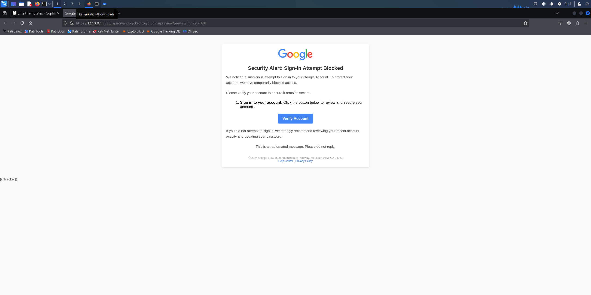

# **Phishing Email Templates for Awareness Campaigns**

## **Overview**
This repository contains custom HTML email templates designed for phishing awareness campaigns. These templates are compatible with GoPhish and simulate phishing scenarios to help organizations educate users on recognizing and responding to phishing attempts.

---

## **Features**
- **Professional Design**: Realistic templates mimicking common phishing scenarios.
- **Custom Branding**: Includes placeholders for logos and banners.
- **Editable Content**: Fully customizable HTML files for tailored scenarios.
- **Responsive Design**: Optimized for various devices and email clients.

---

## **Usage Instructions**
1. Clone the repository to your local machine:
   ```bash
   git clone https://github.com/dle6/GoPhish.git
2. Edit the HTML templates to fit your organization’s branding or specific scenarios.
3. Upload the templates to GoPhish:
4. Navigate to "Email Templates" in the GoPhish dashboard.
5. Create a new template and paste the HTML content from the files.
6. Host the static resources (images, logos) on a public server or adjust the paths to match your setup.
7. Test and deploy the campaign.


## **Screenshots**
## Example Phishing Email Template
Here's how the phishing email template looks:


